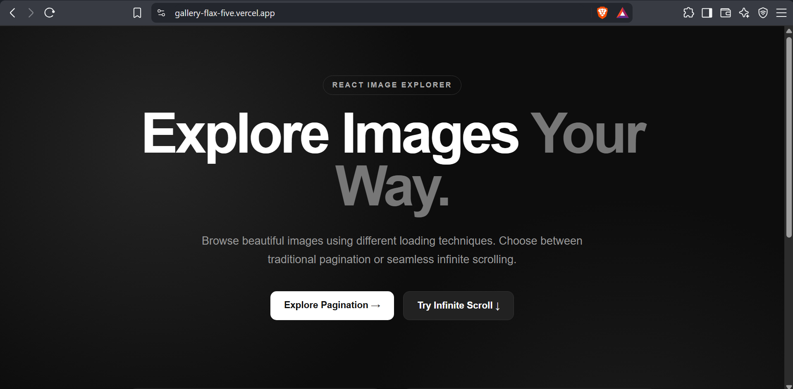
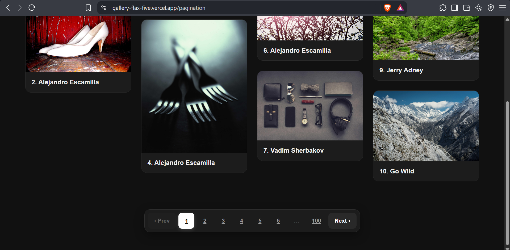
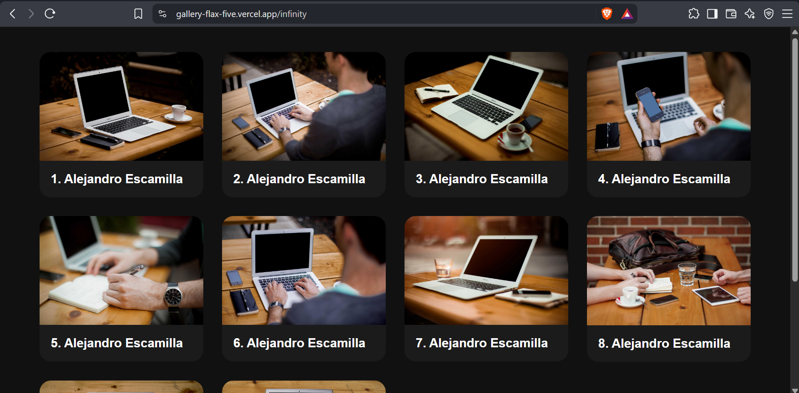

# 📸 React Image Gallery

A modern, responsive image gallery built with **React.js + Vite** using the **Picsum Photos API**.

This project demonstrates two different approaches to loading large collections of images:

- 📄 Pagination
- ♾️ Infinite Scrolling

It also includes a responsive masonry-style image layout and React Router navigation.

---

## 🚀 Live Demo

🔗 **Live Demo:** Add your deployed website URL here.

https://gallery-flax-five.vercel.app/

---

## 📸 Screenshots

Add screenshots of your project here.

---

## ✨ Features

### 🏠 Home Page

- Clean landing page
- Navigation to different gallery implementations
- React Router based navigation

### 📄 Pagination

- Fetches images page by page
- Previous/Next navigation
- Responsive pagination
- Loads only the required page of images

### ♾️ Infinite Scrolling

- Automatically loads more images when reaching near the bottom
- No need to click a "Load More" button
- Automatically increments the API page
- Existing images remain visible while new images are added
- Prevents duplicate API requests while loading

### 🖼️ Responsive Masonry Gallery

- Pinterest-style image layout
- Images maintain their original aspect ratio
- Responsive column layout
- Works across desktop, tablet and mobile devices
- Images are not forced into square boxes

### ⚡ Performance

- Uses React state efficiently
- Prevents duplicate API requests during loading
- Uses `useEffect` for API calls and event listeners
- Uses `useRef` to keep track of the loading state inside the scroll listener

---

## 🛠️ Tech Stack

| Technology | Purpose |
|---|---|
| React.js | Frontend UI |
| Vite | Development and build tool |
| Axios | API requests |
| React Router | Page navigation |
| JavaScript | Application logic |
| CSS3 | Styling and responsive layout |
| Picsum Photos API | Image data |

---

## 🌐 API

This project uses the **Picsum Photos API**.

### API Endpoint

https://picsum.photos/v2/list

### Pagination Example

https://picsum.photos/v2/list?page=1&limit=10

The API returns information such as:

{
  "id": "0",
  "author": "Alejandro Escamilla",
  "width": 5616,
  "height": 3744,
  "url": "https://unsplash.com/...",
  "download_url": "https://picsum.photos/..."
}

---

## ♾️ How Infinite Scrolling Works

The infinite scrolling implementation follows this flow:

User Scrolls
      ↓
Check distance from bottom
      ↓
Less than 200px?
      ↓
     YES
      ↓
Increase page number
      ↓
useEffect detects page change
      ↓
API request
      ↓
Receive next 10 images
      ↓
Append images to existing state
      ↓
User continues scrolling
      ↓
Repeat

The scroll position is calculated using:

const total = window.scrollY + window.innerHeight;
const device = document.body.offsetHeight;

const remaining = device - total;

When the user gets close to the bottom:

if (remaining <= 200) {
    setpage(prev => prev + 1);
}

---

## 🔄 Appending New Images

Instead of replacing the existing images:

setimageData(data);

the infinite scroll implementation appends new images:

setimageData(prev => [...prev, ...data]);

This allows the gallery to continuously grow:

Page 1
↓
Images 1 - 10

Page 2
↓
Images 11 - 20

Page 3
↓
Images 21 - 30

Page 4
↓
Images 31 - 40

---

## 🧠 React Concepts Used

This project was built to practice several important React concepts.

### useState

Used to manage application state:

const [imageData, setimageData] = useState([]);
const [page, setpage] = useState(1);

### useEffect

Used for:

- API requests
- Scroll event listeners
- Event listener cleanup
- Running code when the page number changes

Example:

useEffect(() => {
    callapi();
}, [page]);

This calls the API whenever the `page` value changes.

### useRef

Used to keep track of the loading state inside the scroll event without recreating the scroll event listener.

const loadingRef = useRef(false);

### React Router

Used to navigate between different parts of the application:

Home
 ↓
Pagination
 ↓
Infinite Scroll

---

## 📱 Responsive Design

The gallery automatically changes the number of columns depending on screen size.

Desktop
4 columns

Tablet
3 columns

Small Tablet
2 columns

Mobile
1 column

The images maintain their original aspect ratio instead of being forced into square containers.

---

## ⚙️ Installation

### 1. Clone the repository

git clone https://github.com/Rohan-Netrakar/Gallery.git

### 2. Navigate into the project

cd Gallery

### 3. Install dependencies

npm install

### 4. Start the development server

npm run dev

The application will be available at:

http://localhost:5173

---

## 📦 Build for Production

Create a production build:

npm run build

Preview the production build:

npm run preview

The production files will be generated inside:

dist/

---

## 🚀 Deployment

This project can be deployed using platforms such as:

- Render
- Vercel
- Netlify
- GitHub Pages

For a Vite application, build the project using:

npm run build

Then deploy the generated `dist` folder according to the hosting platform's requirements.

---

## 🎯 What I Learned

This project helped me understand:

- React component structure
- React state management
- useState
- useEffect
- useRef
- API requests with Axios
- REST API pagination
- Infinite scrolling
- Browser scroll events
- Event listeners
- Event listener cleanup
- React Router
- Responsive CSS
- CSS columns / masonry layouts
- Managing asynchronous API requests
- Preventing duplicate API requests
- Working with external APIs
- Handling state updates in React
- Understanding React dependency arrays
- Understanding stale values inside event listeners

---

## 🔮 Future Improvements

Possible improvements for the project:

- 🔍 Search images
- ❤️ Favorite images
- 🏷️ Filter images by author
- 🌙 Light/Dark mode
- 🖼️ Full-screen image preview
- ⬇️ Download images
- 🔄 Retry failed API requests
- ⏳ Skeleton loading animations
- 📱 Better mobile navigation
- 🔗 Share individual images
- 🗂️ Category-based galleries
- 🔎 Image search functionality
- 📌 Save favorite images locally

---

## 👨‍💻 Author

### Rohan Netrakar

B.Tech — Electronics & Communication Engineering

### Interests

- React.js
- Node.js
- Java
- Backend Development
- Full-Stack Development
- Data Structures & Algorithms

---

## ⭐ Support

If you found this project useful or interesting, consider giving the repository a ⭐ on GitHub.

---

## 📄 License

This project is created for learning and portfolio purposes.